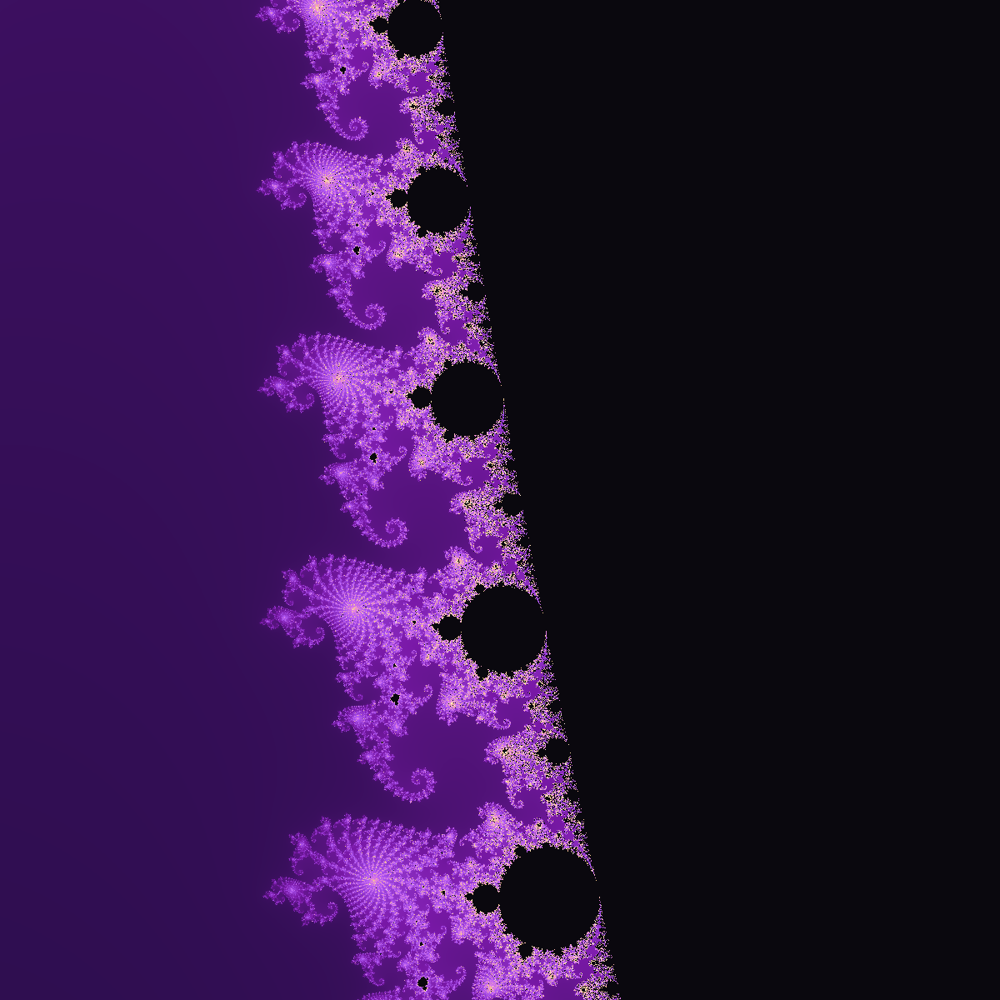

Take a number, square it, add a constant, and repeat forever. That's the entire rule behind the Mandelbrot set — no calculus, no exotic notation, just:

```
z = z² + c
```

Start with `z = 0`. Pick a point `c` on the complex plane. Feed `z` back into the formula over and over. For some values of `c`, the result stays small forever, orbiting some bounded region near the origin. For others, it rockets off toward infinity within a handful of steps. Color every point in the plane by which of those two things happens — and, for the points that escape, color them by *how fast* — and the picture above appears, unasked for, out of arithmetic.

That's the whole trick. Nobody drew this shape. Nobody designed the spirals or the little pinched buds that ring the main body. They're a byproduct of a two-term recurrence relation, discovered rather than invented, the way a mathematician might discover that a room full of mirrors produces a hallway with no end.

## The boundary is where it gets interesting

The black interior is the "stays bounded" set proper — every `c` in there loops forever without escaping. The flat purple exterior is the fast-escaping majority, shaded by how many iterations it survived before crossing the escape threshold. Neither of those regions is the point.

The point is the edge between them: an infinitely wrinkled coastline where zooming in never simplifies anything. Ordinary curves flatten out the closer you look — a circle starts looking like a straight line if you zoom in far enough. The Mandelbrot boundary refuses to do that. Zoom into any point on it and the wrinkles just keep wrinkling, forever, at every scale.



_A crop from "seahorse valley," a strip of boundary just left of the main cardioid's cusp. Every one of those spirals hides a miniature, slightly deformed copy of the entire set — and each of those copies has its own seahorse valley, recursing as far as your floating-point precision holds out._

That crop is roughly the width of a pinhead relative to the full picture above it — around 0.04 units of the complex plane, versus the full set's span of roughly 3. Nothing was smoothed or invented to get there; it's the same `z = z² + c` loop, just run for more iterations over a tighter window, with `double`-precision floats starting to show their limits at the very finest whorls.

## Why this lives on a coding blog

This site already leans on the same idea for its background texture — [Truchet tiles, mazes, Voronoi cells, and a genuine aperiodic Penrose tiling](/blog/more-than-text/), all generated fresh from a seeded PRNG rather than drawn by hand. The Mandelbrot set is that same instinct taken further: instead of randomness producing variety, a single deterministic formula produces *unbounded* variety. No two regions of the boundary look alike, and yet every single pixel came from running one loop with one input.

If you want to reproduce the image at the top, the core of it is barely more code than the formula itself:

```python
def escape_iterations(c, max_iter=400):
    z = 0
    for i in range(max_iter):
        if abs(z) > 2:
            return i
        z = z * z + c
    return max_iter
```

Run that over a grid of `c` values spanning roughly `-2.5` to `1` on the real axis and `-1.25` to `1.25` on the imaginary axis, map the returned iteration count to a color, and the whole shape falls out — coastline and all.
